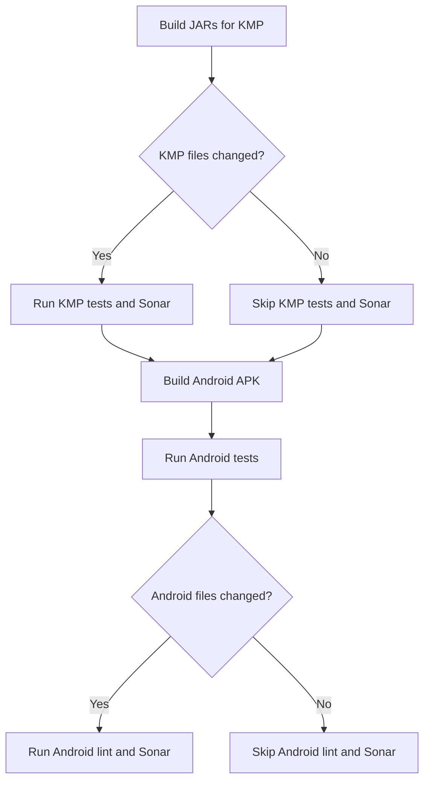

# Kotlin Mobile Monorepo

We recently transitioned from a multi-repo to a monorepo for our mobile applications. This post will go over why and how we did this.

------

## Why Transition to a Monorepo?

### 1. Reduce Toil

Previously, our team of iOS and Android developers managed three separate repositories: Android, iOS, and KMP (Kotlin Multiplatform). The KMP repo was responsible for all concerns including presentation. It streams view state objects representing the view tree of the screen that platforms mapped to our in-house design library tokens (implemented with love using Compose and SwiftUI). This multi-repo setup involved a cumbersome workflow for landing the simplest of changes:

- Developers make changes in the KMP repo and publish artifacts locally.
- They updated platform repos to point to the local artifact for testing.
- After raising and merging the PR on KMP, they released artifacts to our Artifactory instance.
- Finally, they raised PRs on platform repos to update artifact versions and made necessary changes.

God forbid you have bugs or changes requested from review as this is the happy path. We needed to eliminate the ceremony of multiple builds and reviews around landing a single change.

### 2. Shorter Lead Times

As outlined above KMP changes had to go through several steps before landing on platform repos. There is no single commit you can revert confidently. This delay increased our time to release and hotfix, which is crucial during major outages. By consolidating into a monorepo, KMP changes land on platforms immediately, reducing lead times and improving our ability to respond quickly to issues.

### 3. Conflict Management

The probability of conflicts (both git and logical) scales exponentially with team size. With sixteen developers landing changes daily, it's a significant risk that's only multiplied by long lead times. By using a monorepo, we ensure that changes are integrated more frequently, reducing the chances of conflicts and making it easier to resolve them when they occur.

### 4. Improved Locality

While the transition to a monorepo didn't change much for iOS locality, Android developers saw significant benefits. The unified repo enhances refactoring, debugging, and IDE support across Android/KMP projects, making the development process smoother and more efficient.

## How We Enabled the Monorepo

### Gradle Composite Build

We used Gradle's composite build feature to combine android and KMP building into a single step, simplifying the build process. Here is an example of how this is done in the android `settings.gradle.kts`:

```kotlin
includeBuild("../your-kmp-gradle-project") {
    dependencySubstitution {
        substitute(module("com.#careem.rides.engine:rides-di"))
            .using(project(":rides:di"))
    }
}
```

### Kotlin Native compilation filters

Though we couldn't use Gradle composite builds for iOS, we configured the kotlin multiplatform plugin to compile only necessary targets for our XCFramework. By default it compiles 3 architectures so this reduced build times by 65%.

```kotlin
extensions.configure(KotlinMultiplatformExtension::class) {
    val targets = this.targets
        .mapNotNull { it as? KotlinNativeTarget }
        .filter(useBuildFlagsIfAny) // Reads properties in the local.properties file
    val xcFramework = XCFramework(name)

    targets.forEach {
        it.binaries.framework(name) {
            this.configure()
            xcFramework.add(this)
        }
    }
}
```

### CI Workflow Optimization

Running all tests and builds for every change would be too expensive and time-consuming. Instead, we optimized our CI workflows to be conditional based on the files that have changed.
We initially went with the approach of running a workflow to produce jars and the xcframework, then forking into platform workflows if required. Instead, we decided to fork the workflows from the start which lets use use a linux machine for the android workflow, and an m1 machine only for ios. This also saves time by avoiding the deploy and fetch steps for the output artifacts.
Kotlin native compilation also takes longer so we run KMP verifications and tests right before android which ends up with both pipelines taking around the same time to finish.



## Conclusion

By transitioning to a monorepo, we have streamlined our development process, reduced lead times, and improved overall efficiency. This change allows us to focus more on delivering high-quality features and less on managing the complexities of a multi-repo setup. The benefits in terms of reduced toil, shorter lead times, conflict management, and improved locality have made a significant positive impact on our workflow.

